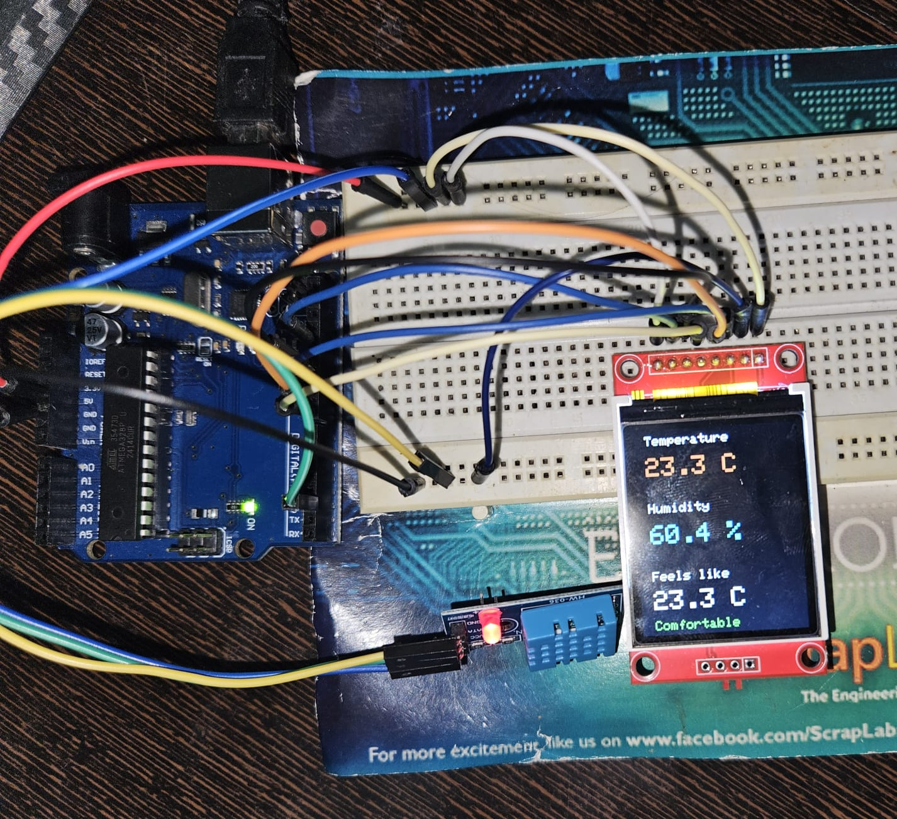

# DHT11 Ambient Monitor

A small Arduino project I built to monitor room temperature and humidity. It reads from a DHT11 sensor and shows the data on a 1.8" ST7735 TFT display. Also calculates the heat index (what it actually feels like) and shows a comfort label that changes colour depending on how bad it is.

---

## Features

- Temperature in °C
- Humidity in %
- Heat index using the Rothfusz formula
- Comfort level indicator (Comfortable / Warm / Uncomfortable / Dangerous) with colour coding
- Only redraws values that have changed
- Shows an error message if the sensor fails to read

---

## Components

| Component | Model | Notes |
|---|---|---|
| Microcontroller | Arduino Uno | - |
| Sensor | DHT11 (HW-036 module) | - |
| Display | ST7735 1.8" TFT | 128×160, communicates over SPI |
| Breadboard | Standard breadboard | Used to split the 5V and GND across components |
| Jumper wires | Male-to-male and male-to-female | Around 15 wires total |

---

## Wiring

### Power setup

The Arduino Uno has only one 5V pin, so I used the breadboard power rails to share it across components.

1. Arduino **5V** → any hole in the **red (+) rail** on the breadboard
2. Arduino **GND** → any hole in the **blue (−) rail** on the breadboard

Both the sensor and the display draw power from the breadboard rather than directly from the Arduino.

---

### Display - ST7735 (pin order top to bottom on my module)

| Display pin | Connects to |
|---|---|
| LED | Breadboard + rail |
| SCK | D13 |
| SDA | D11 |
| A0 (DC) | D8 |
| RESET | D9 |
| CS | D10 |
| GND | Breadboard - rail |
| VCC | Breadboard + rail |

---

### Sensor - DHT11 HW-036

| Pin | Connects to |
|---|---|
| VCC | Breadboard + rail |
| DATA | D2 |
| GND | Breadboard - rail |

---

## Libraries

Install these from the Arduino IDE library manager (Sketch → Include Library → Manage Libraries):

- `DHT sensor library` - by Adafruit
- `Adafruit Unified Sensor` - required by the above, install when prompted
- `Adafruit ST7735 and ST7789 Library`

---

## How the heat index works

The heat index is calculated using the Rothfusz formula, which takes both temperature and humidity into account to estimate how hot it actually feels. It only kicks in above 27°C and 40% RH since the formula isn't reliable below those values. Under those conditions, it just shows the raw temperature instead.

Comfort levels are based on the heat index result:

| Heat index | Label | Colour |
|---|---|---|
| Below 27°C | Comfortable | Green |
| 27°C - 32°C | Warm | Yellow |
| 32°C - 39°C | Uncomfortable | Orange |
| Above 39°C | Dangerous | Red |

---

## Sensor specs

| | Range | Accuracy |
|---|---|---|
| Temperature | 0-50°C | ±2°C |
| Humidity | 20-90% RH | ±5% RH |
| Update rate | 1 Hz max | - |
